# Fit and Brawl Gym - Database Entity Relationship Diagram

## Database Overview
**Database Name:** `fit_and_brawl_gym`  
**Generated:** November 19, 2025  
**Total Tables:** 30

---

## 📊 Complete ERD (Mermaid)

```mermaid
erDiagram
    %% Core User System
    users ||--o{ user_memberships : "has"
    users ||--o{ user_reservations : "books"
    users ||--o{ feedback : "submits"
    users ||--o{ user_notifications : "receives"
    users ||--o{ active_sessions : "has"
    users ||--o{ password_reset_tokens : "requests"
    users ||--o{ remember_password : "has"
    users ||--o{ feedback_votes : "votes"
    users ||--o{ recurring_bookings : "creates"
    
    %% Trainer System
    users ||--o| trainers : "is"
    trainers ||--o{ trainer_shifts : "works"
    trainers ||--o{ trainer_day_offs : "has"
    trainers ||--o{ trainer_availability_blocks : "blocked"
    trainers ||--o{ trainer_activity_log : "logged"
    trainers ||--o{ user_reservations : "assigned"
    trainers ||--o{ recurring_bookings : "assigned"
    trainers }o--o{ memberships : "teaches"
    
    %% Membership System
    memberships ||--o{ user_memberships : "subscribed"
    memberships ||--o{ membership_trainers : "links"
    trainers ||--o{ membership_trainers : "links"
    
    %% Admin Relations
    users ||--o{ admin_permissions : "granted"
    users ||--o{ admin_logs : "performs"
    users ||--o{ admin_logs : "target"
    users ||--o{ security_verification_codes : "generates"
    users ||--o{ sensitive_change_requests : "initiates"
    users ||--o{ trainer_availability_blocks : "blocks"
    users ||--o{ trainer_activity_log : "logs"
    
    %% Booking System
    recurring_bookings ||--o{ user_reservations : "generates"
    user_reservations ||--o{ user_reservations : "rescheduled_from"
    
    %% Feedback System
    feedback ||--o{ feedback_votes : "has"
    
    %% Users Table
    users {
        varchar id PK "MBR-25-0012, TRN-25-0003, ADM-25-0001"
        varchar username UK
        varchar email UK
        text email_encrypted
        varchar contact_number
        varchar password "bcrypt hashed"
        enum role "member, admin, trainer"
        varchar avatar
        tinyint is_verified
        enum account_status "active, suspended, locked, pending"
        varchar verification_token
        varchar otp
        datetime otp_expiry
        int otp_attempts
        timestamp last_otp_request
        datetime last_logout
        timestamp created_at
    }
    
    %% Trainers Table
    trainers {
        int id PK
        varchar user_id FK
        varchar email UK
        varchar name
        varchar phone
        enum specialization "Gym, MMA, Boxing, Muay Thai"
        text bio
        varchar photo
        varchar emergency_contact_name
        varchar emergency_contact_phone
        int max_clients_per_day "DEFAULT 3"
        enum status "Active, Inactive, On Leave"
        tinyint password_changed
        timestamp deleted_at
        timestamp created_at
        timestamp updated_at
    }
    
    %% Trainer Shifts
    trainer_shifts {
        int id PK
        int trainer_id FK
        enum day_of_week "Monday-Sunday"
        enum shift_type "morning, afternoon, night, none"
        time custom_start_time
        time custom_end_time
        time break_start_time
        time break_end_time
        tinyint is_active
        timestamp created_at
        timestamp updated_at
    }
    
    %% Trainer Day Offs
    trainer_day_offs {
        int id PK
        int trainer_id FK
        enum day_of_week "Monday-Sunday"
        tinyint is_day_off
        timestamp created_at
        timestamp updated_at
    }
    
    %% Trainer Availability Blocks
    trainer_availability_blocks {
        int id PK
        int trainer_id FK
        date date
        datetime block_start_time
        datetime block_end_time
        tinyint is_all_day
        enum session_time "Morning, Afternoon, Evening, All Day"
        varchar reason
        varchar blocked_by FK
        enum block_status "blocked, available"
        timestamp created_at
        timestamp updated_at
    }
    
    %% Trainer Activity Log
    trainer_activity_log {
        int id PK
        int trainer_id FK
        varchar admin_id FK
        varchar action "Added, Edited, Status Changed, Deleted"
        text details
        datetime timestamp
    }
    
    %% Memberships
    memberships {
        int id PK
        varchar plan_name
        varchar class_type
        int weekly_hours_limit "DEFAULT 24"
    }
    
    %% Membership Trainers Junction
    membership_trainers {
        int membership_id PK_FK
        int trainer_id PK_FK
    }
    
    %% User Memberships
    user_memberships {
        int id PK
        varchar user_id FK
        int plan_id FK
        varchar admin_id FK
        varchar cash_received_by FK
        varchar name
        varchar country
        varchar permanent_address
        varchar plan_name
        int duration "days"
        varchar qr_proof
        datetime date_submitted
        datetime date_approved
        varchar remarks
        enum request_status "pending, approved, rejected"
        date start_date
        date end_date
        enum billing_type "monthly, quarterly"
        enum payment_method "online, cash"
        enum cash_payment_status "unpaid, paid, cancelled"
        datetime cash_payment_date
        enum membership_status "active, expired, cancelled"
        enum source_table "user_memberships, subscriptions"
        int source_id
        timestamp created_at
        timestamp updated_at
    }
    
    %% User Reservations
    user_reservations {
        int id PK
        varchar user_id FK
        int trainer_id FK
        int recurring_parent_id FK
        int rescheduled_from_id FK
        enum session_time "Morning, Afternoon, Evening"
        enum class_type "Boxing, Muay Thai, MMA, Gym"
        date booking_date
        datetime start_time
        datetime end_time
        varchar reschedule_reason
        timestamp rescheduled_at
        int buffer_minutes "DEFAULT 10"
        enum booking_status "confirmed, completed, cancelled, blocked"
        timestamp booked_at
        timestamp updated_at
        varchar reservation_state
        timestamp cancelled_at
        datetime unavailable_marked_at
    }
    
    %% Recurring Bookings
    recurring_bookings {
        int id PK
        varchar user_id FK
        int trainer_id FK
        enum class_type "Boxing, Muay Thai, MMA, Gym"
        enum recurrence_pattern "weekly"
        date start_date
        date end_date
        time start_time
        time end_time
        int occurrences_count
        enum status "active, cancelled, completed"
        timestamp created_at
        timestamp updated_at
    }
    
    %% Booking Config
    booking_config {
        int id PK
        varchar config_key UK
        varchar config_value
        text description
        timestamp updated_at
    }
    
    %% Equipment
    equipment {
        int id PK
        varchar name
        enum category "Cardio, Flexibility, Core, Strength Training, Functional Training"
        enum status "Available, Maintenance, Out of Order"
        date maintenance_start_date
        date maintenance_end_date
        text maintenance_reason
        text description
        varchar image_path
        timestamp created_at
        timestamp updated_at
    }
    
    %% Products
    products {
        int id PK
        varchar name
        enum category "Supplements, Hydration, Snacks, Accessories, Boxing Products"
        int stock
        enum status "in stock, low stock, out of stock"
        varchar image_path
        timestamp created_at
        timestamp updated_at
    }
    
    %% Contact
    contact {
        int id PK
        varchar first_name
        varchar last_name
        varchar email
        varchar phone_number
        text message
        enum status "unread, read"
        tinyint archived
        timestamp deleted_at
        timestamp date_submitted
    }
    
    %% Feedback
    feedback {
        int id PK
        varchar user_id FK
        varchar username
        varchar email
        varchar avatar
        text message
        tinyint is_visible
        int helpful_count
        int not_helpful_count
        timestamp date
    }
    
    %% Feedback Votes
    feedback_votes {
        int id PK
        int feedback_id FK
        varchar user_id FK
        enum vote_type "helpful, not_helpful"
        timestamp created_at
    }
    
    %% User Notifications
    user_notifications {
        int id PK
        varchar user_id FK
        varchar notification_type
        varchar title
        text message
        varchar admin_identifier
        tinyint is_read
        tinyint sent_via_email
        timestamp created_at
    }
    
    %% Active Sessions
    active_sessions {
        int id PK
        varchar user_id FK
        varchar session_id
        varchar ip_address
        text user_agent
        timestamp login_time
        timestamp last_activity
        tinyint is_current
    }
    
    %% Password Reset Tokens
    password_reset_tokens {
        int id PK
        varchar user_id FK
        varchar created_by FK
        varchar token UK
        datetime expires_at
        datetime used_at
        varchar ip_address
        varchar user_agent
        timestamp created_at
    }
    
    %% Remember Password
    remember_password {
        int id PK
        varchar user_id FK
        varchar token_hash
        timestamp created_at
    }
    
    %% Login Attempts
    login_attempts {
        varchar identifier PK
        int attempt_count
        datetime last_attempt
        timestamp created_at
    }
    
    %% Security Events
    security_events {
        int id PK
        varchar event_type
        enum severity "low, medium, high, critical"
        varchar user_id
        varchar username
        varchar ip_address
        text user_agent
        varchar endpoint
        text details
        timestamp created_at
    }
    
    %% API Rate Limits
    api_rate_limits {
        varchar identifier PK
        int request_count
        datetime window_start
        timestamp updated_at
    }
    
    %% Sensitive Change Requests
    sensitive_change_requests {
        int id PK
        varchar user_id FK
        varchar admin_id FK
        varchar confirmation_token UK
        enum change_type "email, phone, recovery_email, security_question"
        varchar old_value
        varchar new_value
        enum status "pending, confirmed, rejected, expired"
        datetime expires_at
        datetime confirmed_at
        varchar ip_address
        varchar user_agent
        timestamp created_at
        timestamp updated_at
    }
    
    %% Security Verification Codes
    security_verification_codes {
        int id PK
        varchar admin_id FK
        varchar code UK
        varchar purpose
        datetime valid_until
        datetime used_at
        timestamp created_at
    }
    
    %% Admin Permissions
    admin_permissions {
        int id PK
        varchar admin_id FK
        varchar granted_by FK
        varchar permission_name
        timestamp granted_at
        datetime expires_at
        tinyint is_active
    }
    
    %% Admin Logs
    admin_logs {
        int id PK
        varchar admin_id FK
        varchar target_user_id FK
        varchar admin_name
        varchar action_type
        varchar target_user
        int target_id
        text details
        text previous_value
        text new_value
        varchar ip_address
        varchar user_agent
        enum severity "low, medium, high, critical"
        datetime timestamp
    }
    
    %% Unified Logs
    unified_logs {
        int id PK
        enum log_level "debug, info, warning, error, critical"
        enum log_source "security, activity, application, database, email, system"
        varchar category
        text message
        varchar user_id
        varchar username
        varchar ip_address
        varchar endpoint
        longtext context "JSON"
        text stack_trace
        timestamp created_at
    }
    
    %% Activity Log
    activity_log {
        int id PK
        varchar user_id
        enum role "member, trainer, admin"
        varchar action
        datetime timestamp
    }
    
    %% Non-member Receipts
    nonmember_receipts {
        int id PK
        varchar receipt_id UK
        varchar service
        varchar name
        varchar email
        varchar phone
        date service_date
        int amount
        datetime created_at
    }
```

---

## 🔗 Relationship Summary

### Core Relationships

**User → Memberships**
- Users subscribe to membership plans
- Admin approves/rejects membership requests
- Support for both online and cash payments

**User → Reservations**
- Users book training sessions with trainers
- Sessions are time-based (Morning/Afternoon/Evening)
- Support for recurring bookings and rescheduling

**Trainer → Schedules**
- Trainers have shifts and day-offs
- Admins can block trainer availability
- Activity logging for all trainer changes

**Feedback System**
- Users submit feedback
- Other users vote on feedback helpfulness
- Admin controls visibility

---

## 📝 Key Features

### ID Format Conventions
- **Members:** `MBR-25-0012`
- **Trainers:** `TRN-25-0003`
- **Admins:** `ADM-25-0001`

### Security Features
✅ Password hashing (bcrypt)  
✅ Token-based authentication  
✅ Rate limiting  
✅ Login attempt tracking  
✅ Security event logging  
✅ Two-factor authentication (OTP)  
✅ Session management  
✅ API security middleware  

### Booking System Features
✅ Session-based bookings (Morning/Afternoon/Evening)  
✅ Recurring weekly bookings  
✅ Trainer shift management  
✅ Day-off scheduling  
✅ Availability blocking  
✅ Rescheduling with history  
✅ Buffer time management  
✅ Multiple training disciplines (Boxing, MMA, Muay Thai, Gym)  

### Payment System
✅ Dual payment methods (online/cash)  
✅ Cash payment tracking  
✅ Admin approval workflow  
✅ Billing cycles (monthly/quarterly)  
✅ QR proof upload  
✅ Payment status tracking  

---

**Generated from:** `schema.sql`  
**Database Version:** MariaDB 10.4.32  
**PHP Version:** 8.3.27
