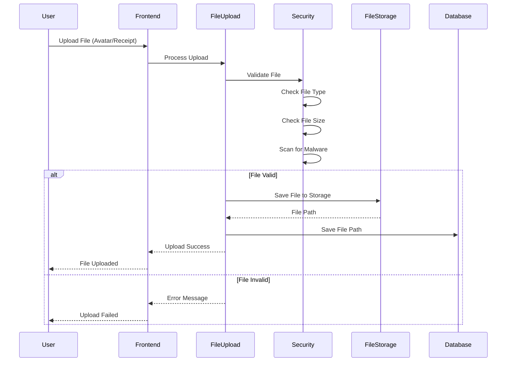

# Fit & Brawl Gym - System Architecture Diagram

## System Overview

Fit & Brawl is a comprehensive gym management system built with PHP and MySQL.

---

## Architecture Diagram

```mermaid
graph TB
    subgraph "Client Layer"
        Browser[Web Browser]
        Mobile[Mobile Browser]
    end

    subgraph "Application Server"
        subgraph "Frontend Layer"
            PHP_Frontend[PHP Pages<br/>- Public Pages<br/>- Admin Panel<br/>- Trainer Dashboard]
            StaticAssets[Static Assets<br/>CSS/JS/Images]
        end

        subgraph "Application Layer"
            Auth[Authentication Module<br/>- Login/Logout<br/>- Session Management<br/>- Email Verification]
            UserMgmt[User Management<br/>- Registration<br/>- Profile Management<br/>- Role Management]
            Membership[Membership Module<br/>- Subscription Requests<br/>- Approval Workflow<br/>- Status Tracking]
            Booking[Reservation System<br/>- Trainer Booking<br/>- Session Management<br/>- Availability Checking]
            TrainerMgmt[Trainer Management<br/>- Trainer CRUD<br/>- Schedule Management<br/>- Day-off Management]
            Equipment[Equipment Management<br/>- Equipment Tracking<br/>- Status Updates]
            Products[Products Management<br/>- Inventory Management<br/>- Stock Tracking]
            Feedback[Feedback System<br/>- User Feedback<br/>- Voting System<br/>- Moderation]
            Contact[Contact/Inquiry System<br/>- Contact Forms<br/>- Message Management]
            Receipt[Receipt Generation<br/>- PDF Generation<br/>- QR Code Generation]
        end

        subgraph "Business Logic Layer"
            SessionMgr[Session Manager<br/>- Session Handling<br/>- Timeout Management]
            ActivityLog[Activity Logger<br/>- Admin Actions<br/>- Audit Trail]
            EmailService[Email Service<br/>- PHPMailer<br/>- SMTP Configuration]
            FileUpload[File Upload Handler<br/>- Security Validation<br/>- File Storage]
            RateLimiter[Rate Limiter<br/>- API Protection<br/>- Request Throttling]
        end

        subgraph "API Layer"
            REST_API[REST APIs<br/>- User APIs<br/>- Booking APIs<br/>- Admin APIs]
            AJAX_Handlers[AJAX Handlers<br/>- Real-time Updates<br/>- Form Submissions]
        end
    end

    subgraph "Data Layer"
        MySQL[(MySQL Database<br/>- Users<br/>- Memberships<br/>- Reservations<br/>- Trainers<br/>- Equipment<br/>- Products<br/>- Feedback<br/>- Activity Logs)]
    end

    subgraph "External Services"
        FileStorage[File Storage<br/>- Avatar Uploads<br/>- Receipt Images<br/>- Product Images<br/>- Equipment Images]
        SMTP[SMTP Server<br/>Gmail<br/>- Email Verification<br/>- Notifications]
    end

    Browser --> PHP_Frontend
    Mobile --> PHP_Frontend
    Browser --> StaticAssets
    Mobile --> StaticAssets

    PHP_Frontend --> Auth
    PHP_Frontend --> UserMgmt
    PHP_Frontend --> Membership
    PHP_Frontend --> Booking
    PHP_Frontend --> TrainerMgmt
    PHP_Frontend --> Equipment
    PHP_Frontend --> Products
    PHP_Frontend --> Feedback
    PHP_Frontend --> Contact
    PHP_Frontend --> Receipt

    Auth --> SessionMgr
    UserMgmt --> SessionMgr
    Membership --> ActivityLog
    TrainerMgmt --> ActivityLog
    Equipment --> ActivityLog
    Products --> ActivityLog
    Feedback --> ActivityLog

    UserMgmt --> EmailService
    Membership --> EmailService
    Contact --> EmailService

    UserMgmt --> FileUpload
    Membership --> FileUpload
    Products --> FileUpload
    Equipment --> FileUpload

    REST_API --> UserMgmt
    REST_API --> Booking
    REST_API --> TrainerMgmt
    AJAX_Handlers --> REST_API

    Auth --> MySQL
    UserMgmt --> MySQL
    Membership --> MySQL
    Booking --> MySQL
    TrainerMgmt --> MySQL
    Equipment --> MySQL
    Products --> MySQL
    Feedback --> MySQL
    Contact --> MySQL
    ActivityLog --> MySQL

    FileUpload --> FileStorage
    EmailService --> SMTP

    style Browser fill:#e1f5ff
    style Mobile fill:#e1f5ff
    style PHP_Frontend fill:#fff4e6
    style StaticAssets fill:#fff4e6
    style MySQL fill:#ffe6e6
    style FileStorage fill:#e6ffe6
    style SMTP fill:#e6ffe6
```

---

## Detailed Component Architecture

---

## Technology Stack

| Layer | Technology |
|-------|-----------|
| **Frontend** | HTML5, CSS3, JavaScript (Vanilla) |
| **Backend** | PHP 8.1 |
| **Database** | MySQL |
| **Storage** | Local File System |
| **Email** | PHPMailer + SMTP (Gmail) |
| **PDF Generation** | Server-side PHP |
| **Session Management** | PHP Sessions |
| **Security** | Password Hashing (bcrypt), CSRF Protection, Rate Limiting |

---

## Database Schema Overview

### Core Tables
1. **users** - User accounts (members, admins, trainers)
2. **user_memberships** - Membership subscriptions and approvals
3. **user_reservations** - Training session bookings
4. **trainers** - Trainer information and availability
5. **trainer_day_offs** - Weekly day-off schedule
6. **trainer_availability_blocks** - Admin-blocked dates/times
7. **equipment** - Gym equipment inventory
8. **products** - Product inventory (consumables)
9. **feedback** - User feedback and reviews
10. **feedback_votes** - Feedback voting system
11. **contact** - Contact form submissions
12. **admin_logs** - Audit trail for admin actions
13. **activity_log** - System activity tracking

---

## Authentication Flow

---

## Booking Flow

---

## File Upload Flow

---

## Security Features

1. **Authentication**
   - Password hashing with bcrypt
   - Email verification
   - OTP (One-Time Password) support
   - Session management with timeout

2. **Authorization**
   - Role-based access control (RBAC)
   - Page-level access restrictions
   - API endpoint protection

3. **Data Protection**
   - Prepared statements (SQL injection prevention)
   - CSRF token protection
   - Input validation and sanitization
   - File upload security checks

4. **Rate Limiting**
   - API request throttling
   - Login attempt limiting
   - OTP request limiting

---

## API Endpoints

### Public APIs
- `/api/check_username.php` - Username availability check
- `/api/get_trainers.php` - Get available trainers
- `/api/get_available_dates.php` - Get available booking dates
- `/api/book_session.php` - Book a training session
- `/api/cancel_booking.php` - Cancel a booking
- `/api/contact_api.php` - Submit contact form
- `/api/feedback_vote.php` - Vote on feedback

### Admin APIs
- `/admin/api/admin_dashboard_api.php` - Dashboard statistics
- `/admin/api/admin_users_api.php` - User management
- `/admin/api/admin_subscriptions_api.php` - Subscription management
- `/admin/api/admin_reservations.php` - Reservation management
- `/admin/api/admin_equipment_api.php` - Equipment management
- `/admin/api/admin_products_api.php` - Product management
- `/admin/api/admin_feedback_api.php` - Feedback management
- `/admin/api/admin_contact_api.php` - Contact management

---

## Additional Information

### System Requirements
- PHP 8.1 or higher
- MySQL 5.7 or higher
- Web server (Apache/Nginx)
- SMTP server access for email functionality

### Development Environment
- Local development typically uses XAMPP/WAMP
- MySQL database for local testing
- File storage on local filesystem

Would you like me to:
- Add more detail to any specific component?
- Create separate diagrams for specific flows (e.g., membership approval workflow)?
- Include data flow diagrams for specific processes?
- Document specific business logic workflows?

